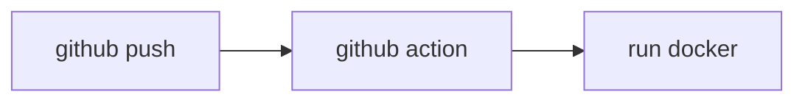

[](https://github.com/hz2/project-nest/actions/workflows/action-docker.yml)
 
 

## About

a pim system;

- Frontend: [https://github.com/hz2/project-pim](https://github.com/hz2/project-pim)

> next.js / react + mui + typescript

- Backend: [https://github.com/hz2/project-nest](https://github.com/hz2/project-nest)

> nest.js + typeorm + mysql + graphql

## Flow chart



[Docker package](https://github.com/hz2/project-nest/pkgs/container/project-nest)

## Installation

```bash
$ npm install
```

## Running the app

```bash
# development
$ npm run start

# watch mode
$ npm run start:dev

# production mode
$ npm run start:prod
```
